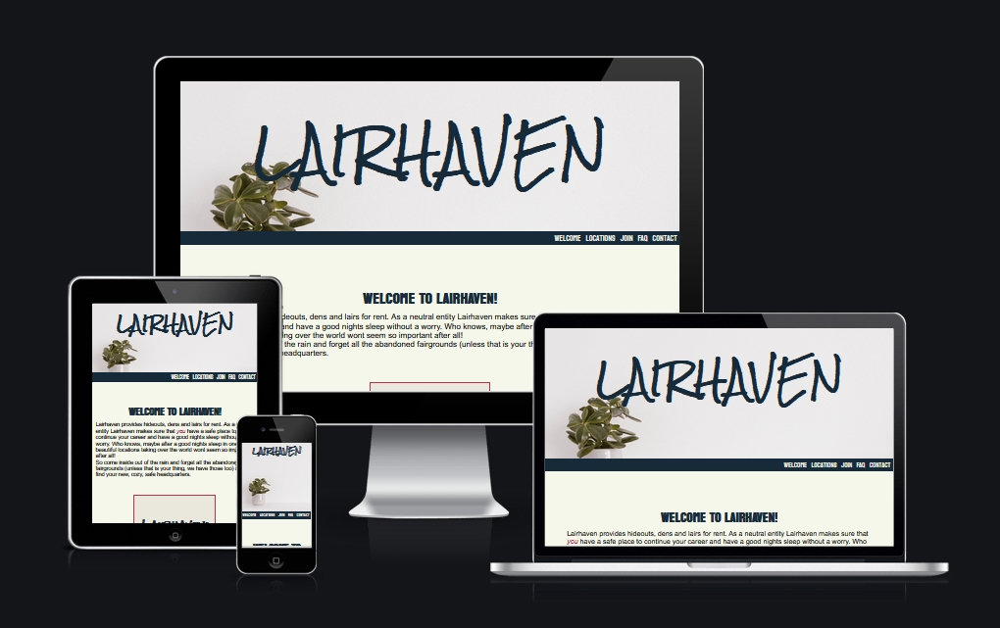
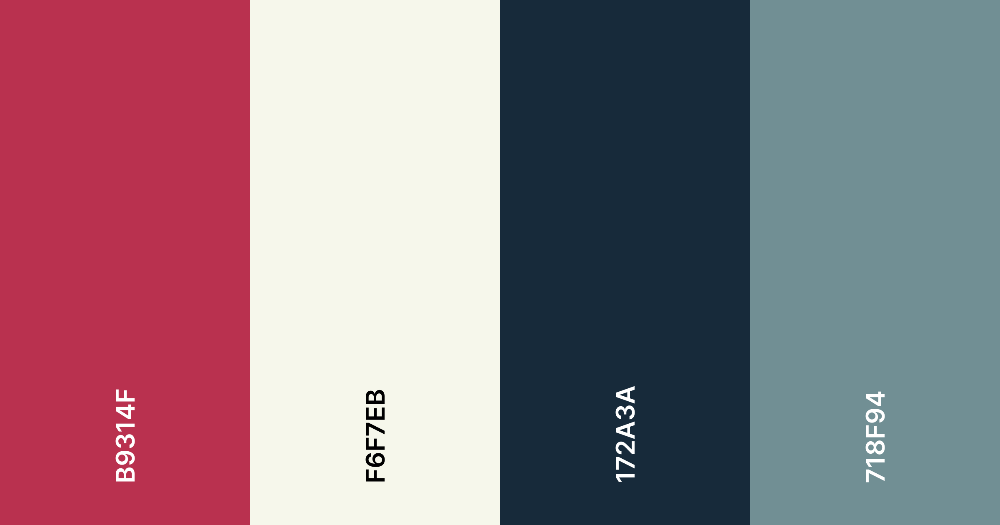

# Lairhaven - website for hideout rental service

Lairhaven provides hideouts and headquarters for superheroes and villains.
This company leases great locations that are safe and hidden even if they are in the middle of a city,
but also looks for other locations like abandoned bunkers, caves, abandoned fairgrounds, castles, 
abandoned factories and so on, since some customers prefer it that way.
As a bonus this company does the hideout stylings to match the customers brand.

## Design points

Design point: mobile-first. 
- Goal is to make everything as flexible as possible
- Minimum amount of code changes between different viewports

### User goals:
What is their goal? What problem does this product or feature solve for them?
- User needs to find a safe lair. As a bonus this company does the styling and moving for them too.

		
What are some of the actions or operations they are likely to perform?
- Customer care (online) to make the contract
- Styling of location
- Moving in (secretly, with ninjas)
- Customer care (24/7, because evil never sleeps)

### User Stories:
- As a customer, I need to be able to easily see what website offers
- As a customer, I need to be able to contact the company
- As a customer, I want to know more about the company
- As a customer, I need the company to be reachable

## Design Choices
- At the halfway of the project it was changed from three pages to have all the information in one page. This made it more mobile friendly.
Also because of this I have added JavaScript code to make navigation bar visible when scrolling, even though it wasn't part of project 1 requirements.

### Other, more personal, goals
- To learn to write commit messages 
- Problem solving by testing

# Features

### Header:
- Company name is responsive
- Hero image changes size depending of how wide screen it is viewed on

### Navigation bar:
- Links to other pages (Main, Help and Application form)
- Active site is in red color, other links are black.
- When hovered over, link changes color

### Footer:
- Company's contact information, Social media links

## Main page: What the company has to offer

### Main:
- Welcome text

### Bulletpoint list:
- List of services the site offers
- Bulletpoint has icons from FontAwesome as bullets
- List is inside a stylized box

### Locations:
- Pictures and descriptions of locations
- Each location box has a header, picture and description.
- On screens 499px and under locations are in a column.
- On screens between 500px and 949px locations are showing up two on a row
- on screen 950px and up locations are three in a row

### Wrap up:
- Under locations there is a box that has text and links to other pages 

## HELP-page

### FAQ:
- Most asked questions and company history

### Contact Customer Service
- Information on how to contact

## APPLICATION-page
### Fill the form:
- 5 fields where customer can fill their information, which 3 are required
- choose interesting locations (checkbox)
- textarea to tell more of their wishes
- User agreement checkboxes, one required
- Button to send the form

### Possible coming features:
- Articles: Couple of articles with few quick tips and a pictures.
" Dark Gothic is not for villains only!"
- Customer feedback: Couple of opinions from customers (can have some fun here)
- Different color schemes for heroes and villains, can choose by clicking a button in menu
- New locations, like student apartments for minions and sidekicks

 # TESTING

 - Tested with The W3C CSS Validation service. Congratulations! No Error Found.
 - Tested with nu HTML checker, all three pages. No errors or warnings to show.
 - Tested with Google Chrome developer tool Lighthouse to find any remaining errors and to make page more accessible.

## ISSUES

20/5:After having meeting with my mentor 19.5.2022 it was decided to change the page structure from 3 different page to one main page. This would make the page more mobile friendly. At the same time the navigation bar would be set to be sitting at the top of the screen by all times. Because of this change there will be a lot of change to the code.

21/5: One of the main issues after moving all the information to one page was re-do navigation bar. It needed to have links to all the different sections to the page, and to make navigating in the site easier it should be accessible whole time. Hence, it needed to be sticky and stuck at the top of the page. I havent yet learned JavaScript to do this, so I have taken the needed code from W3 Schools tutorial.
-Currently having problem to make navbar to move up when scrolling down, so navbar will be sitting over the header for now.
-Tried to add a second header text to header. Too many different fonts.

22/5: Adding margin to the page when screen is wider than 950px. Have to exclude Locations from the .section rule and create  ID locations-section for it.
Changed the hero-image to more neutral one, so that it doesnt matter if the header covers part of it in different viewports. Moved original image lower down.
Problem: Unexpected space between sections, need to locate the problem. Found the typo from CSS.

Got the sticky navbar working in one line but then its too wide for the narrower devices. Solution: Smaller font to smaller screens (1.2rem), change to 1.6rem screen 499px>.

Using Unicorn Revealer-app to find what port of the page sticks out. 
Using Google Chrome Lighthouse developer tool to check for problems. Found dublicate ID "consent". Changed outer div ID to "form-consent"

## DEPLOYMENT

- Site was deployed to Github Pages.
- From Github, I chose the current project and Settings.
- On the leftside of the page there is Pages.
- Choose the "Main" branch
- Site will be published.
- This site is published at https://cozyplantlady.github.io/Lairhaven/

## CREDITS

Thank you to my very helpful mentor, Simen Daehlin. He has gien me a lot of good pointers on what I should do and how to improve my coding.

### Media:
- Photos are open source from PxHere

### Icons
- All the icons were taken from Font Awesome

### COLOR SCHEME
-This color scheme was suggested by my mentor Simen Daehlin

### Code from Love Running:
* {
    margin: 0;
    padding: 0;
    border: none;
}
REM double reset from Simen Daehlin
html {font-size: 62,5%;}
body {font-size: 1.6px}

Code for Sticky Navbar:
https://www.w3schools.com/howto/howto_js_navbar_sticky.asp