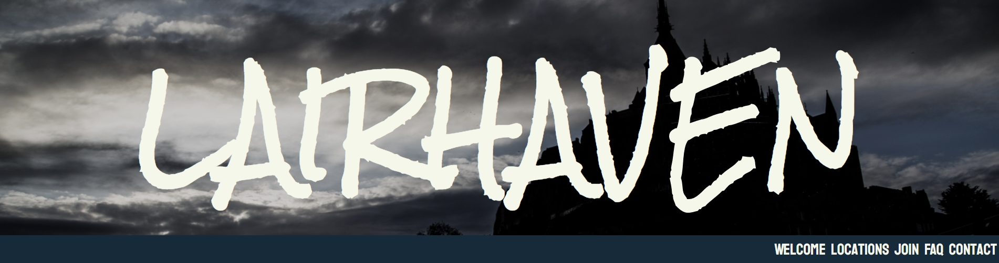
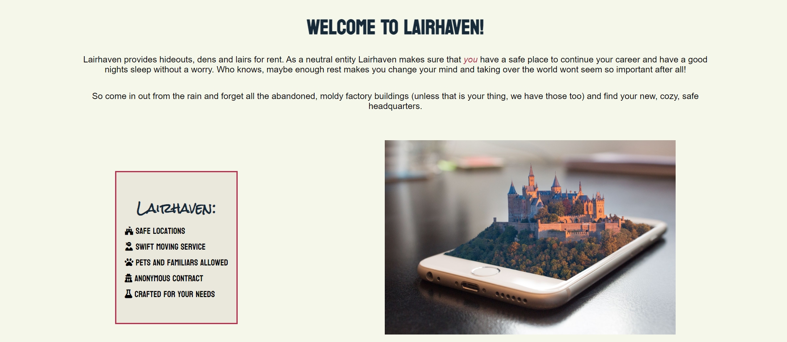
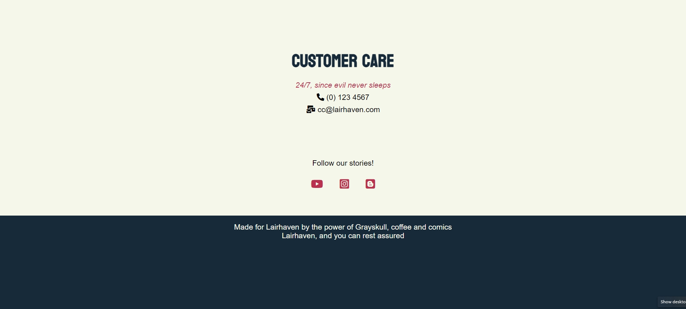

# Lairhaven - website for heroes and villains looking for headquarters

Lairhaven provides hideouts and headquarters for superheroes and villains.
Company leases great locations that are safe and hidden even if they are in the middle of a city,
but also looks for other locations like abandoned bunkers, caves, abandoned fairgrounds, castles, 
abandoned factories and so on, since some customers prefer it that way.

As a bonus this company does the hideout stylings to match the customers brand and helps with moving.


## Design Strategy
Design point: mobile-first.
- All the information can be found from one page 
- Goal is to make everything as flexible as possible
- Minimum amount of code changes between different viewports
- Colors are chosen to be calm and harmonic. 
- Header is dark and menacing, to get the attention of villains (even if company is neutral)

### User goals:
What is their goal? What problem does this product or feature solve for them?
- User needs to find a safe lair. As a bonus this company does the styling and moving for them too.

What are some of the actions or operations they are likely to perform?
- Showing a collection of different locations
- Renting out location
- Styling of location
- Moving in/out (secretly, with ninjas)
- Customer care (24/7, because evil never sleeps)

### User Stories:

New user:
- As a new user, I need to be able to easily see what website offers
- As a user, I want to know more about the company
- As a user, I want to rent a location

Returning user:
- As a returning user, I want to contact the customer care


# Features

### Header:
- Company name and hero image are respinsive and change size on different viewports. Hero image is neutral to not disturb the visibility of the logo.

### Navigation bar:
- Links to different section ID's (Welcome, Locations, Join, FAQ and Contact)
- When hovered over, link changes color
- Navigation bar is visible when scrolling down, to make it easier to jump between sections



### Welcome:
- Welcome text to tell visitor what the company is about
- Bulletpoint list of services the site offers
- Bulletpoint has icons from FontAwesome as bullets




### Locations:
- Pictures and descriptions of locations
- Each location box has a header, picture and description.
- Depending of the width of the viewport locations are shown 1, 2 or 3 in a row
- Pictures are meant to be thumbnails, and wont be bigger than 300px x 500px


### Join us!:
- Right under the Locations so customer can apply right away!
- 5 fields where customer can fill their information, which of 3 are required
- Choose interesting locations (checkbox)
- Textarea to tell more about their wishes
- User agreement checkboxes, one required
- Button to send the form


### FAQ:
- Most asked questions and company history
- Tells the customer more about the company 


### Contact
- Information on how to contact Customer Care
- There is more space here between Customer Care section and footer to make landing to the section after clicking navigation more smooth.
- Links to Lairhaven socialmedia accounts. These are chosen to be more for Lairhaven sharing stories, and not that much for communicating with potential customers.

### Footer:




### Possible coming features:
- Articles: Couple of articles with few quick tips and a pictures.
" Dark Gothic is not for villains only!"
- Customer feedback: Couple of opinions from customers (can have some fun here)
- Different color schemes for heroes and villains, can choose by clicking a button in menu (This requires JavaScript si I skipped it)
- New locations, like student apartments for minions and sidekicks. 
- Dropdown menu for FAQ-section, to hide the answers. Then it's more space to have more questions

 # TESTING

 ## User stories
###New user:
####As a new user, I need to be able to easily see what website offers
     -

- As a user, I want to know more about the company
- As a user, I want to rent a location

Returning user:
- As a returning user, I want to contact the customer care


## Validating HTML 5 and CSS 3
 - Tested with The W3C CSS Validation service. Congratulations! No Error Found.
 - Tested with nu HTML checker, all three pages. No errors or warnings to show.
 - Tested with Google Chrome developer tool Lighthouse to find any remaining errors and to make page more accessible. 
 - Current points: Performance 83, Accessability 100, Best Practices 100, SEO 100.
 - Using Unicorn Revealer-app to find what part of the page sticks out.

## Bugs

- 20/5:After having meeting with my mentor 19.5.2022 it was decided to change the page structure from 3 different page to one main page. This would make the page more mobile friendly. At the same time the navigation bar would be set to be sitting at the top of the screen by all times. Because of this change there will be a lot of change to the code.

- 21/5: One of the main issues after moving all the information to one page was re-do navigation bar. It needed to have links to all the different sections to the page, and to make navigating in the site easier it should be accessible whole time. Hence, it needed to be sticky and stuck at the top of the page. I havent yet learned JavaScript to do this, so I have taken the needed code from W3 Schools tutorial.
-~~Currently having problem to make navbar to move up when scrolling down, so navbar will be sitting over the header for now.~~ *Fixed*

- Tried to add a second header text to header. Too many different fonts.

- 22/5: Adding margin to the page when screen is wider than 950px. Have to exclude Locations from the .section rule and create  ID locations-section for it.
Changed the hero-image to more neutral one, so that it doesnt matter if the header covers part of it in different viewports. Moved original image lower down since it is still a good image that gives information of the site.
- ~~Problem: Unexpected space between sections, need to locate the problem.~~ *Found the typo from CSS.* -Fixed-

- Got the sticky navbar working in one line but then its too wide for the narrower devices. Solution: Smaller font to smaller screens (1.2rem), change to 1.6rem screen 499px>. -Fixed-

- Using Google Chrome Lighthouse developer tool to check for problems. Found dublicate ID "consent". Changed outer div ID to "form-consent" -Fixed-

- Found out with CSS validator that my double reset code for fonts (to make the default font size 10px and makes it easier to use rem as measurement) was wrong this whole time. I had written it as fontsize: 62,5% instead of 62.5%. Had to make sure it is right this time.

- 23/5: Bug: Tested page in different viewports and browsers, and found a bug on Firefox that locations-boxes have different sizes depending on how much text they have.
Also in wide screen (over 1900px wide) the pictures become four in a row. Trying to fix this by adding more margin.
- ~~After clicking navbar and jumping to different parts on a page h2 is in different levels.~~ Fixed most of it by making sure that connected ID was in the section and not in inner dividers. Found the bug from the code, added padding to h2 and corrected the typo.


## DEPLOYMENT

- Site was deployed to Github Pages.
- From Github, I chose the current project and Settings.
- On the leftside of the page there is Pages.
- Choose the "Main" branch
- Site will be published.
- This site is published at https://cozyplantlady.github.io/Lairhaven/


# CREDITS

## People:
- Thank you to my very helpful mentor, [Simen Daehlin](https://github.com/Eventyret/eventyret). He has given me a lot of good pointers on what I should do and how to improve my coding.

## Media:
- Photos are open source from [Pxhere](https://pxhere.com/)

## Icons
- All the icons were taken from [Font Awesome](https://fontawesome.com/)

## Codes from other sources:

- Code for Sticky Navbar from [W3schools tutorial](https://www.w3schools.com/howto/howto_js_navbar_sticky.asp)
```
<script>
        window.onscroll = function () {
            myFunction()
        };

        var navbar = document.getElementById("navbar");
        var sticky = navbar.offsetTop;

        function myFunction() {
            if (window.pageYOffset >= sticky) {
                navbar.classList.add("sticky")
            } else {
                navbar.classList.remove("sticky");
            }
        }
    </script>
  ```
  And 
```
  .sticky {
    position: fixed;
    top: 0;
    width: 100%;
```

## Thank you for reading!